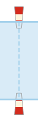
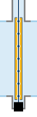
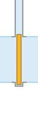
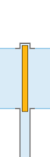
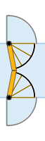
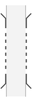
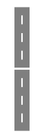

# Kolk configuratiestring syntax

## Syntax

Een kolkconfiguratiestring voldoet aan de volgende syntax
```
 "(","N"|"O"|"Z"|"W",("ABC"|"CBA")?,")",symbol+
```

waarbij voor `symbol` een tekencombinatie
gebruikt wordt uit de tabel, zie **Symbolen**

Beschrijvend:

```
 ( [Ingang-volgens-netwerk-richting] [Naamvolgorde] ) Configuratiestring
```

Bijvoorbeeld:

```
( W ABC )<.:>.    .<.>.    .<.>: 
```

De configuratiestring bestaat uit drie delen: een deel tussen
haakjes aan het begin, een reeks symbolen en (eventueel)
afsluitend vrije tekst tussen haakjes. De symbolen staan voor
kolk-elementen, in de JavaScript-code aangeduid als _**elements**_

In het eerste gedeelte, tussen haakjes, staat achtereenvolgens:

* één letter die de windstreek aanduid waar de ingang van de kolk
  ligt volgens de netwerkrichting. Zie '**Windstreek**'

* De lettervolgorde 'ABC' of 'CBA' die de lexicografische nummering
  van de deuren vastlegt. Als hier 'ABC' staat of niets is vermeld,
  krijgt de meest linker deur de naam 'A', de volgende 'B', etcetera.
  Alleen als hier 'CBA' staat, is deze volgorde omgekeerd. Deze namen
  worden afgebeeld in het diagram en gebruikt om de schutruimtes mee
  aan te duiden.
  
Spaties in de het eerste gedeelte tussen de haakjes worden genegeerd en
kunnen naar believen worden toegevoegd om de leesbaarheid te verhogen.

De configuratiestring is een tekstuele, maar engiszins grafische, 
representatie van de sluis.
 
## Windstreek

De kolk wordt altijd horizontaal getekend en _altijd_ van west
naar oost _of_ van noord naar zuid. Dit geldt voor zowel  de
configuratiestring als  het uiteindelijke diagram. De linkerkant
van het diagram komt dus _altijd_ overeen met ofwel de westzijde van
de kolk ofwel de noordzijde van de kolk. De linkerkant wordt in het
uiteindelijk diagram altijd voorzien van de letter "N" _of_ "W". Evenzo
wordt de rechterzijde altijd voorzien van de letter "Z" _of_ "O".

De windstreek geeft aan, aan welke zijde van de kolk zich de ingang
bevindt volgens de netwerkrichting zoals RWS die hanteert. De enige
invloed die dit heeft op het uiteindelijke diagram is een pijltje
in de tekening. Het is echter van belang voor het toekennen van
id's aan de sluishoofden, aangezien deze altijd oplopend in de
netwerk-richting genummerd worden. (Dit staat dus los van de naamgeving!)

De windstreek-letter geeft ook aan of de kolk noord→zuid of west→oost
getekend word. Zowel de letter "W" als de letter "O" zorgen er dus
voor dat de kolk west→oost getekend word! En, zowel de letter "N"
als de letter "Z" zorgen ervoor dat de kolk noord→zuid getekend word.


## Symbolen

De serie symbolen tekenen samen de sluisconfiguratie op een een wijze die zowel voor computers als mensen
begrijpelijk is. De symbolen dienen gekozen te worden uit de eerste kolom van de volgende tabel

| Symbool    | (Bestands)naam                 | Tooltip                                                      | Afbeelding | Beschrijving
| ---        | ---                            | ---                                                          | ---          | ---   
| `I01`      | stopstreep                     | stopstreep                                                   |  | Stopstrepen horen altijd bij 1 bepaalde deur                                                                                            |
| `C01`      | gladde-kolk                    | kolkdeel                                                     |  | Getekend op 'sluisdeur-/sluishoofdbreedte'. Voor een langere Sluiskolk of langer Sluiskolkdeel wordt dit symbool naar smaak herhaald. Deze wordt in principe alleen toegepast in zgn. "gladde kolken" (even breed als de Sluishoofden). |
| `C02`      | kolk-verbreed                  | Verbreed Kolkdeel                                            |  | Een kolkdeel dat breder is dan de 'deur-/hoofdbreedte' van de Sluiskolk. Voor een langere Sluiskolk of Sluiskolkdeel wordt dit symbool naar behoefte herhaald. Een Verbreed Kolkdeel (C02) wordt altijd vooraf gegaan door een Kolkovergang (C04, C06, C08, C10 of C11) of  door een ander Verbreed Kolkdeel. |
| `C03`      | kamerkolk-kop-b                | Kolkovergang, breed-naar-smal                                |  | Adaptor voor een kolkversmalling. Dit kolkdeel kan alleen volgen op een Verbreed Kolkdeel (C02).                                        |
| `C04`      | kamerkolk-kop-d                | Kolkovergang, smal-naar-breed                                |  | Adaptor voor een kolkverbreding. Na dit kolkdeel moet een Verbreed Kolkdeel (G02) volgen.                                               |
| `C05`      | kamerkolk-kop-p                | Kolkovergang, breed-naar-smal                                |  | Adaptor voor een kolkversmalling. Dit kolkdeel kan alleen volgen op een Verbreed Kolkdeel (C02).                                        |
| `C06`      | kamerkolk-kop-q                | Kolkovergang, smal-naar-breed                                |  | Adaptor voor een kolkverbreding. Na dit kolkdeel moet een Verbreed Kolkdeel (G02) volgen.                                               |
| `C07`      | kamerkolk-kop-6-rond           | Kolkovergang, breed-naar-smal                                |  | Adaptor voor een kolkversmalling. Dit kolkdeel kan alleen volgen op een Verbreed Kolkdeel (C02).                                        |
| `C08`      | kamerkolk-kop-j-rond           | Kolkovergang, smal-naar-breed                                |  | Adaptor voor een kolkverbreding. Na dit kolkdeel moet een Verbreed Kolkdeel (G02) volgen.                                               |
| `C09`      | kamerkolk-kop-r-rond           | Kolkovergang, breed-naar-smal                                |  | Adaptor voor een kolkversmalling. Dit kolkdeel kan alleen volgen op een Verbreed Kolkdeel (C02).                                        |
| `C10`      | kamerkolk-kop-9-rond           | Kolkovergang, smal-naar-breed                                |  | Adaptor voor een kolkverbreding. Na dit kolkdeel moet een Verbreed Kolkdeel volgen.                                                     |
| `C11`      | binnenfrontkolk-kop-links      | Kolkovergang, smal-naar-breed                                |  | Adaptor voor een kolkverbreding. Na dit kolkdeel moet een Verbreed Kolkdeel volgen.                                                     |
| `C12`      | binnenfrontkolk-kop-rechts     | Kolkovergang, breed-naar-smal                                |  | Adaptor voor een kolkversmalling. Dit kolkdeel kan alleen volgen op een Verbreed Kolkdeel (C02).                                        |
| `C13`      | komkolk-kop-links              | Kolkovergang, smal-naar-breed                                |  | Adaptor voor een kolkverbreding. Na dit kolkdeel moet een Verbreed Kolkdeel volgen.                                                     |
| `C14`      | komkolk-kop-rechts             | Kolkovergang, breed-naar-smal                                |  | Adaptor voor een kolkversmalling. Dit kolkdeel kan alleen volgen op een Verbreed Kolkdeel (C02).                                        |
| `D01`      | puntdeur-links                 | puntdeur links                                               |  |                                                                                                                                         |
| `D02`      | puntdeur-rechts                | puntdeur rechts                                              |  |                                                                                                                                         |
| `D03`      | puntdeur-pin-links             | dubbelkerende enkelvoudige puntdeur met pin, links           |  |                                                                                                                                         |
| `D04`      | puntdeur-pin-rechts            | dubbelkerende enkelvoudige puntdeur met pin, rechts          |  |                                                                                                                                         |
| `D05`      | puntdeur-dubbelk-links         | dubbelkerende enkelvoudige puntdeur, links                   |  |                                                                                                                                         |
| `D06`      | puntdeur-dubbelk-rechts        | dubbelkerende enkelvoudige puntdeur, rechts                  |  |                                                                                                                                         |
| `D07`      | draaideur-lb                   | enkele draaideur, links, scharnier boven, aanslag onder      |  |                                                                                                                                         |
| `D08`      | draaideur-lo                   | enkele draaideur, links, scharnier onder, aanslag boven      |  |                                                                                                                                         |
| `D09`      | draaideur-rb                   | enkele draaideur, rechts, scharnier boven, aanslag onder     |  |                                                                                                                                         |
| `D10`      | draaideur-ro                   | enkele draaideur, rechts, scharnier onder, aanslag boven     |  |                                                                                                                                         |
| `D11`      | hefdeur                        | hefdeur                                                      |  |                                                                                                                                         |
| `D12`      | hangroldeur                    | hangroldeur                                                  |  |                                                                                                                                         |
| `D13`      | roldeur-boven                  | roldeur boven                                                |  |                                                                                                                                         |
| `D14`      | roldeur-onder                  | roldeur, onder                                               |  |                                                                                                                                         |
| `D15`      | waaierdeur-links               | waaierdeur, links                                            |  |                                                                                                                                         |
| `D16`      | waaierdeur-rechts              | waaierdeur, rechts                                           |  |                                                                                                                                         |
| `I02`      | schot                          | Deur of schot, alleen bij hoogwater                          |  |                                                                                                                                         |
| `I03`      | breed-schot                    | Deur of schot over brede kolk, alleen bij hoogwater          |  |                                                                                                                                         |
| `D17`      | puntdeur-links-hwk             | puntdeur, links, hoogwaterkerig                              |  |                                                                                                                                         |
| `D18`      | puntdeur-rechts-hwk            | puntdeur, rechts, hoogwaterkering                            |  |                                                                                                                                         |
| `D19`      | puntdeur-pin-links-hwk         | dubbelkerende enkelvoudige puntdeur met pin, links, hoogwaterkering |  |                                                                                                                                         |
| `D19`      | puntdeur-pin-rechts-hwk        | dubbelkerende enkelvoudige puntdeur met pin, rechts, hoogwaterkering |  |                                                                                                                                         |
| `D20`      | puntdeur-dubbelk-links-hwk     | dubbelkerende enkelvoudige puntdeur, links, hoogwaterkering  |  |                                                                                                                                         |
| `D21`      | puntdeur-dubbelk-rechts-hwk    | dubbelkerende enkelvoudige puntdeur, rechts, hoogwaterkering |  |                                                                                                                                         |
| `D22`      | hefdeur-hwk                    | hefdeur                                                      |  |                                                                                                                                         |
| `D23`      | roldeur-boven-hwk              | roldeur, hoogwaterkering, boven                              |  |                                                                                                                                         |
| `D24`      | roldeur-onder-hwk              | roldeur, hoogwaterkering, onder                              |  |                                                                                                                                         |
| `D25`      | hangroldeur-hwk                | hangroldeur, hoogwaterkering                                 |  |                                                                                                                                         |
| `D26`      | waaierdeur-links-hwk           | waaierdeur, hoogwaterkering, links                           |  |                                                                                                                                         |
| `D27`      | waaierdeur-rechts-hwk          | waaierdeur, hoogwaterkering, rechts                          |  |                                                                                                                                         |
| `D28`      | draaideur-lb-hwk               | enkele draaideur, links, scharnier boven, aanslag onder, hoogwaterkering |  |                                                                                                                                         |
| `D29`      | draaideur-lo-hwk               | enkele draaideur, links, scharnier onder, aanslag boven, hoogwaterkering |  |                                                                                                                                         |
| `D30`      | draaideur-rb-hwk               | enkele draaideur, rechts, scharnier boven, aanslag onder, hoogwaterkering |  |                                                                                                                                         |
| `D31`      | draaideur-ro-hwk               | enkele draaideur, rechts, scharnier onder, aanslag boven, hoogwaterkering |  |                                                                                                                                         |
| `I04`      | vaarweg                        | Vaarweg, geen kolk, alleen voor brug buiten kolk             |  |                                                                                                                                         |
| `I05`      | brug-vast                      | Doorvaartopening, vast                                       |  |                                                                                                                                         |
| `I06`      | brug-beweegbaar                | Doorvaartopening, beweegbaar                                 |  |                                                                                                                                         |
| `I07`      | weg-over-hoofd                 | Wegdek over sluishoofd                                       |  |                                                                                                                                         |
